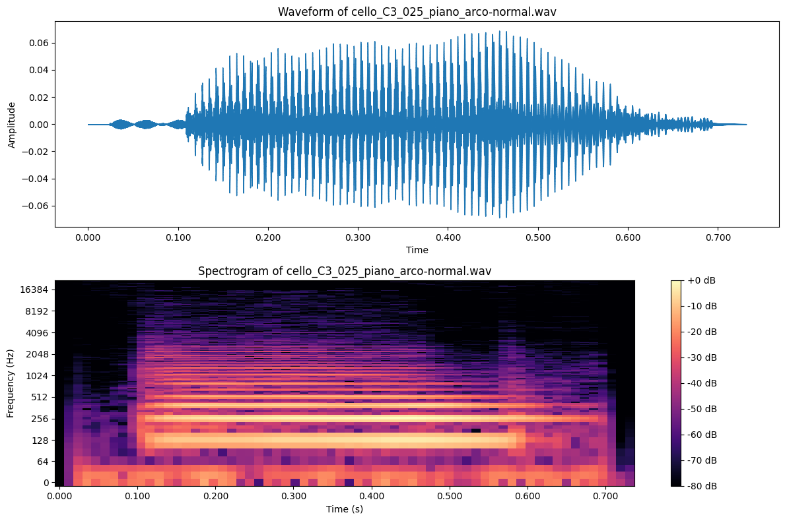
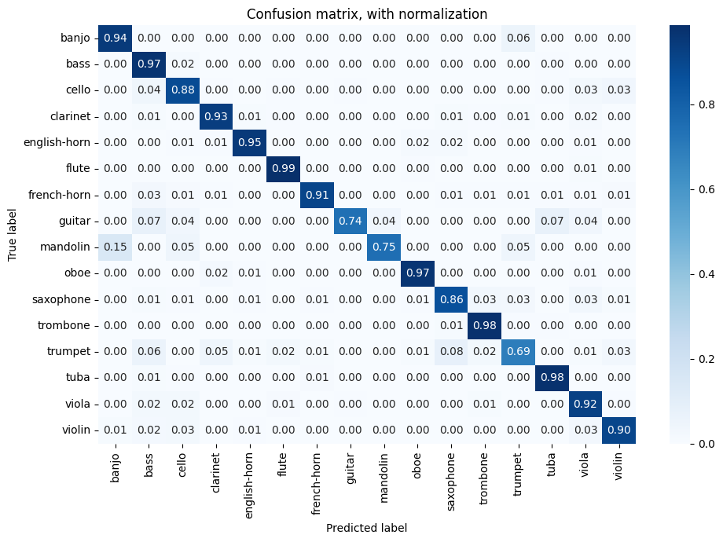

# Homework 2: Machine Learning Basics

Start Date and Time| Due Date and Time | Cut-off Date and Time |
---|---|---|
6pm on February 5, 2024 | 6pm on February 19, 2024 | 6pm on February 26, 2024 |

\**Eastern Standard Time (EST) is used for dates and times*

## Setup and Submission Guideline

Remember, to complete this homework you will (1) create a local branch, (2) complete the assignment (3) push your local branch to github, and then (4) create a Pull Request on Github. 

To prepare for this homework assignment:

1. Pull (aka "Sync") the remote homework repo to your local homework repo
1. Create a local branch, and name it "yourname-homework-2"
1. In the
[github.com/MTEC-345/MTEC-345_Homework_Fall2024](https://github.com/MTEC-345/MTEC-345_Homework_Fall2024)
repository, under a folder with your name, create a new folder named
`Homework2`. Add your `README.md` and/or Jupyter Notebook file to this folder.
Do not add the audio samples used for this lab exercise to your homework folder.
1. Complete the Lab Excercise assignment described below
1. Push your local branch to GitHub (this can be done via GitHub Desktop)
1. Use GitHub web interface to make Pull Request from your homework branch to the `main` branch

## Grading Rubric

Description|Grade
---|---:|
**Submission:**|
All required files are submitted via GitHub | 5
All required files are submitted in the correct directory (e.g., `Homework1`) and have the correct name (e.g., `README.md`) | 5
**Understanding & Critical Thinking:**|
The journal demonstrates a clear understanding of the algorithms, methods, and concepts used. | 10
The journal includes reflections or discussions on results, potential improvements, or challenges during the lab exercise. | 10
**Formatting:**|
The journal presents sections and subsections appropriately titled, labeled, and formatted using Markdown syntax. | 10
**Documentation Quality**|
The journal thoroughly documents each step with at least one paragraph in length. | 10
The journal answers all questions in the lab exercise. | 15
The journal includes references and citations, adequately placed and accurately cited. | 5
The journal includes figures, tables, and diagrams in a meaningful fashion. | 5
The journal documents the tools and libraries used in the lab. | 5
**Experimentation & Extensions:**| 
The Jupyter Notebook project implements the hands-on lab exercise | 10
The Jupyter Notebook showcases experimentation with different algorithms, parameters, or techniques beyond the basic requirements. | 5
The journal documents any additional challenges or results that arose from experiments. | 5
**Total**| **100**

**You will receive a grade of zero if you push your journal directly to the main branch.**

## Recommended Readings
- Machine Learning, Revised And Updated Edition:
	- Chapters 1, 2, and 7
- Links:
	- [Machine learning, explained](https://mitsloan.mit.edu/ideas-made-to-matter/machine-learning-explained)
	- [Machine Learning for Everyone In simple words. With real-world examples. Yes, again](https://noeliagorod.com/2019/05/21/machine-learning-for-everyone-in-simple-words-with-real-world-examples-yes-again/)
	- [Machine Learning Applications](https://medium.com/analytics-vidhya/machine-learning-applications-78b7808ab007)
	- [Captcha if you can: how you’ve been training AI for years without realising it](https://www.techradar.com/news/captcha-if-you-can-how-youve-been-training-ai-for-years-without-realising-it)
	- [Stories of AI Failure and How to Avoid Similar AI Fails](https://www.lexalytics.com/lexablog/stories-ai-failure-avoid-ai-fails-2020)

## Lab Exercise: Musical Instrument Classification

### Objective:
In this lab exercise, students will develop a machine-learning model to classify musical instruments based on sound files. They will be introduced to various stages of a machine learning project, from data collection to model deployment, all while using Python and its rich ecosystem of libraries.

### Tools and Libraries used in this lab:
- [**Python:**](https://www.python.org/) The programming language of choice for this project.
- [**Jupyter Notebook:**](https://jupyter.org/) An interactive environment to write and execute Python code.
- [**Scikit-learn:**](https://scikit-learn.org/stable/) A machine learning library.
- [**Librosa:**](https://librosa.org/doc/latest/index.html) A library for music and audio analysis.
- [**matplotlib:**](https://matplotlib.org/) A visualization library.
- [**Seaborn:**](https://seaborn.pydata.org/) A data visualization library.

### Documentation Process
Starting this week, you may document your lab exercise directly in Jupyter Notebook. In this case, you do not need to submit a `README.md` file. Be sure to use markdown syntax in your documentation in Jupyter Notebook. Get started with this lab exercise by creating a new notebook called `InstrumentClassification.ipynb`.

### 1. Setting up the Environment
- Make sure *miniconda* is set up.
- Create a new virtual environment:

```
conda create -n scikit-classify python=3.9
```
- Activate it:

```
conda activate scikit-classify
```
- Install the necessary packages:

```
pip install jupyter scikit-learn librosa pandas numpy seaborn matplotlib==3.7
```
- Launch Jupyter:

```
jupyter notebook
```
### 2. Data Collection and Labeling:
We will use the [sound samples](https://philharmonia.co.uk/resources/sound-samples/) recorded by Philharmonia musicians for this lab exercise. It includes all standard orchestral instruments, guitar, mandolin, banjo, and various percussion instruments. Download all samples from this [link](https://drive.google.com/file/d/1kbtEJnKpijZ-esKSsM5cT3m_z8MlrnUW/view?usp=sharing) and unzip all instruments. All samples from this link are cleaned and are in WAV format for ease of loading. 

#### Get File Names
Create a new cell in Jupyter Notebook and use the following code to get all file names. The following code assumes that the folder named `all-samples-wav` is in the same directory as your Jupyter Notebook for this lab exercise.


```python
# Import the Path class from the pathlib module
from pathlib import Path

# Create a Path object for the directory 'samples'
path = Path('all-samples-wav')

# Initialize an empty list to hold the file paths
files = []

# Check if the path exists and if it's a directory
if path.exists() and path.is_dir():
    # Use a list comprehension with rglob() to gather all .wav files (recursively)
    # and store them in the 'files' list
    files = [file for file in path.rglob('*.wav')]

    # Check how many files were in the directory
    print(f"found {len(files)} audio files in '{path}' folder.")

# If the path doesn't exist or isn't a directory, print a message
else:
    print("'all-samples-wav' directory does not exist.")
```

The code above imports the `Path` class from the `pathlib` module and then creates a `Path` object targeting the "all-samples-wav" directory. It initializes an empty list called `files` intended to hold the paths of .wav files. Before gathering the files, it checks if the "all-samples-wav" directory exists and is indeed a directory. If the directory exists, the code tries to populate the `files` list with all the .wav file paths from the "all-samples-wav" directory and its subdirectories using the `rglob()` method. The code prints out how many files were read before exiting. If the directory does not exist or isn't actually a directory, it informs the user by printing "'all-samples-wav' directory does not exist.".

Experiment with the code above and answer the questions below in your journal:

1. What object type is the variable `path`?
2. What object type is stored in the `files` list?
3. Explain the difference between `path.exists()` and `path.is_dir()`. Why might both checks be necessary?
4. Describe the functionality of the `rglob()` method. How does it differ from the `glob()` method in `pathlib`?
5. What can you infer about the directory structure from the use of `rglob('*.wav')`?
6. What modifications would be needed to include `.mp3` files in the `files` list?
7. If the goal is to also print the names of all the `.wav` files collected, how can you achieve this?
8. Why might it be beneficial to initialize the `files` list before populating it with file paths?

#### Visualize Sound Data
Understanding the dataset through visualization is pivotal in the machine learning process. Visualizations uncover patterns, assist in data cleaning, guide feature engineering, and reveal data distributions. They can validate assumptions about the data, inform model selection, enhance interpretability, and serve as a communicative tool for stakeholders. Without visual insights, one risks navigating the complexities of data without clear direction, potentially leading to less effective models and misunderstood results.

Since we use sound files as datasets, time and frequency domain visualizations are especially helpful. Time domain visualization provides a view of how the amplitude of the sound wave varies over time. It can give insights into the loudness and silence periods of the audio, transients, and more. For instance, spoken words versus pauses can be discerned, or the attack of a musical note in an instrument can be identified. Frequency domain visualization offers a perspective on which frequencies are present in the audio and their respective magnitudes. It can be crucial for determining the tonal characteristics of a sound. For musical instruments, it can help differentiate between them since each instrument has a unique spectral signature. It's especially valuable when you want to see the distribution of pitch, harmonics, and possible overtones.

We will be using `librosa` and `matplotlib` to visualize the first 10 files in the `files` list. Create a new cell and write the code below:

```python
import librosa
import matplotlib.pyplot as plt
import numpy as np
import os

# Go through the first 10 files in `files`
for index, file_path in enumerate(files[:10]):
    # Load the audio file
    y, sr = librosa.load(file_path, sr=None)
    
    # Create a figure with two subplots: one for the waveform and one for the spectrogram
    fig, ax = plt.subplots(2, 1, figsize=(12, 8))
    
    # Plot the waveform
    ax[0].set_title(f"Waveform of {os.path.basename(file_path)}")
    librosa.display.waveshow(y, sr=sr, ax=ax[0])
    ax[0].set_ylabel('Amplitude')
    
    # Compute and plot the spectrogram
    D = librosa.amplitude_to_db(np.abs(librosa.stft(y)), ref=np.max)
    img = librosa.display.specshow(D, sr=sr, x_axis='time', y_axis='log', ax=ax[1])
    ax[1].set_title(f"Spectrogram of {os.path.basename(file_path)}")
    ax[1].set_ylabel('Frequency (Hz)')
    ax[1].set_xlabel('Time (s)')
    fig.colorbar(img, ax=ax[1], format="%+2.0f dB")
    
    plt.tight_layout()
    plt.show()
```


For each audio file in the first 10 entries of the files list, the code performs the following steps:

1. The audio file is loaded using `librosa.load()`, which returns the audio time series `y` and its sample rate `sr`.
2. A figure with two vertically stacked subplots is created. The top subplot is for visualizing the waveform (time-domain representation), and the bottom subplot is for the spectrogram (frequency-domain representation).
3. The audio waveform is plotted using `librosa.display.waveshow()`. The title for this plot includes the filename extracted using `os.path.basename(file_path)`, and denotes it as a waveform.
4. The Short-Time Fourier Transform (STFT) of the audio is computed using `librosa.stft(y)`, and its amplitude is then converted to dB scale using `librosa.amplitude_to_db()`. This processed data, `D`, represents the spectrogram.
5. The spectrogram is visualized using `librosa.display.specshow()`. This plot is labeled to indicate its representation as a spectrogram, and axes are labeled for time and frequency. A color bar is also added to the plot to provide a reference for the dB values in the spectrogram.
6. `plt.tight_layout()` ensures that the plots and their labels don't overlap, and `plt.show()` displays the plots for each audio file.

Experiment with the code above and answer the questions below in your journal:

1. What is the role of the `os.path.basename()` function in this code?
2. What does the Short-Time Fourier Transform (STFT) achieve? Why might it be used instead of a regular Fourier Transform for audio signals?
3. Why might the code use two subplots (one for waveform and one for spectrogram) for each audio file? How does this help in understanding the audio data?
4. How does the color bar in the spectrogram visualization help in interpreting the data? What does it represent?
5. How would the visualization change if you change the `y_axis` parameter in `librosa.display.specshow()` from 'log' to 'linear'?
6. Are there any potential performance bottlenecks in visualizing audio data for a large number of files? How might you handle them?

#### Attach Labels
Labeling the samples is crucial for developing our supervised machine-learning system. Labeling provides the ground truth or answer for each data sample. During training, machine learning algorithms rely on this ground truth to adjust their parameters and improve their predictions. Without labels, the model wouldn't know if its predictions are correct or how it should correct its mistakes. The labels will also be necessary after our model is trained to assess its performance on unseen data. This assessment is done by comparing the model's predictions to actual labels. Labeling provides the necessary guidance and feedback mechanisms for models to learn from data, make accurate predictions, and continuously improve.

Create a new cell and write the code below:


```python
# Define a list of musical instruments to be recognized from the filenames
instruments = [
    'banjo', 'bass', 'bassoon', 'cello', 'clarinet', 
    'contrabassoon', 'double-bass', 'english-horn', 'flute', 
    'french-horn', 'guitar', 'mandolin', 'oboe', 'saxophone', 
    'trombone', 'trumpet', 'tuba', 'viola', 'violin'
]

# Define a function to find the instrument based on the filename
def find_instrument(filename):
    # Iterate over each instrument in the list
    for instrument in instruments:
        # Check if the instrument name exists in the filename (case insensitive)
        if instrument in filename.stem.lower():
            # If found, return the instrument name
            return instrument
    # If no instrument is found, label it as 'other'
    return 'other'

# Create a labels list by applying the find_instrument function 
# on each file in the 'files' list
labels = [find_instrument(file) for file in files]

# Print the total number of labels found for the given path
print(f"found {len(labels)} labels in {path}")
```

The code above creates labels based on filenames by checking if they match any instrument name from the `instruments` list. The function `find_instrument()`, given a filename, finds the matching instrument or returns 'other'. `filename.stem.lower()` is helpful because by calling `stem`, you're getting the filename without the extension, and with `lower()`, you're ensuring a case-insensitive match.
We also use *List Comprehension* to concisely loop through the filenames in `files`. The `find_instrument` function becomes a convenient helper function in this case.

Experiment with the code above and answer the questions below in your journal:

1. What type of argument does the `find_instrument` function expect?
2. If a filename contains the word "bassoon", what will the `find_instrument` function return for that filename?
3. If you have a file object with the path "bassoon_A2_1_forte_normal.wav", what would `file.stem` return?
4. What does the `find_instrument()` function return if it doesn't find any instrument in the filename?
5. How is the labels list generated with List Comprehension?
6. How do you print the labels?
7. How would you modify the code to count and print the number of "other" labels?

#### Encode Labels
The next step is to encode the labels using the `LableEncoder` class from `scikit-learn` to simplify preparing data for the classifiers by converting categorical string labels into a format that machine learning algorithms can handle more effectively. You can read more about the LabelEncoder class [here](https://scikit-learn.org/stable/modules/generated/sklearn.preprocessing.LabelEncoder.html?highlight=labelencoder#sklearn.preprocessing.LabelEncoder). 

Create a new cell and write the code below:


```python
# Import the LabelEncoder class from the sklearn.preprocessing module
from sklearn.preprocessing import LabelEncoder

# Initialize the LabelEncoder
labelencoder = LabelEncoder()

# Fit the encoder on the labels
labelencoder.fit(labels)

# Display the found classes (instruments) 
print(f"{len(labelencoder.classes_)} instruments:", ", ".join(list(labelencoder.classes_)))

# Transform labels to numbers ranging from 0 to n - 1
numbered_labels = labelencoder.transform(labels)

# Print the numerical encoding for each class
print("Numbered labels for each class: ", labelencoder.transform(labelencoder.classes_))
```

When you call `labelencoder.fit(labels)`, the encoder examines all the labels provided in the labels list to identify all unique *classes* (or categories) in the data. In our case, the unique classes will be the instrument names. Based on the detected unique classes, the encoder maps each string label to a unique integer. For example, if the detected unique classes from `labels` are `['banjo', 'bass', 'bassoon']`, the encoder will create the following mapping:

- 'banjo' -> 0
- 'bass' -> 1
- 'bassoon' -> 2

After the fitting process, the encoder stores these unique classes in the `classes_` attribute in the order they appeared during the fitting. This ordering determines the integer each class will map to when performing the transformation.

Once the encoder has been fitted, it can transform any list or array-like structure of labels into its respective numeric format using the `transform` method. Similarly, you can revert numeric labels back to their string form using the `inverse_transform` method. After fitting the `LabelEncoder`, saving or retaining the encoder's state is crucial if you intend to use it for future transformations. If you refit it on different data, the original mapping might be lost or altered, leading to inconsistent label encodings.

### 3. Data Preprocessing
The next step is to extract relevant features from the sound files. We will be using [`librosa`](https://librosa.org/doc/main/index.html), a library for music and audio analysis, to accomplish this task. `librosa` can extract many features from a given audio file such as MFCCs, Chroma, Spectral contrast, and Tonnetz (Read more about sound features you can extract [here](https://librosa.org/doc/latest/feature.html)). For this lab exercise, we will keep it simple and only use MFCCs. MFCCs (Mel-frequency cepstral coefficients) represent the short-term power spectrum of sound, derived from a type of cepstral representation of the audio file, and are commonly used in speech and audio processing for feature extraction. A cepstral representation refers to the result obtained by taking the inverse Fourier transform (IFT) of the logarithm of the spectrum of a signal. Essentially, it's a transformation that decouples a signal's rate and scale features, which is especially useful in voice processing to separate the speaker's identity and pitch. You can read more about MFCCs [here](https://ieeexplore.ieee.org/abstract/document/9955539).

Create a new cell and write the code below:


```python
# Import librosa and numpy modules
import librosa
import numpy as np

# Set constants for audio processing
fs = 44100          # Sampling rate
n_mels = 128        # Number of Mel bands
n_mfcc = 13         # Number of MFCC coefficients to extract

def get_mfcc_features(file_path):
    """
    Extract MFCC features from an audio file.
    
    Parameters:
    - file_path: Path to the audio file.
    
    Returns:
    - A numpy array containing the mean MFCC coefficients.
      If an error occurs, None is returned.
    """
    try:
        # Load audio file
        y, _ = librosa.load(file_path, sr=fs)
        
        # Check if the audio file is too short
        if len(y) < 2:
            print(f"Error loading {file_path}: Too short")
            return None

        # Normalize audio to range [-1, 1]
        y /= np.max(np.abs(y))
        
        # Compute the Mel spectrogram
        S = librosa.feature.melspectrogram(y=y, sr=fs, n_mels=n_mels)
        
        # Compute MFCCs from the log-scaled Mel spectrogram
        mfcc = librosa.feature.mfcc(S=librosa.power_to_db(S), n_mfcc=n_mfcc)
        
        # Return the mean of the MFCCs (across time)
        return np.mean(mfcc, axis=1)
    
    except Exception as e:
        # Handle errors and print an error message
        print(f"Error loading {file_path}. Error: {e}")
        return None

# Extract MFCC features from each audio file, and filter out any None values 
# (resulting from errors or very short files)
feature_vectors = [get_mfcc_features(file) for file in files]
feature_vectors = [fv for fv in feature_vectors if fv is not None]

# Print the total number of feature vectors extracted
print(f"Calculated {len(feature_vectors)} mfcc feature vectors")

```


At the top, the code establishes a set of parameters for audio processing, such as the sampling rate (`fs`) and the number of desired MFCCs (`n_mfcc`). The core functionality resides in the `get_mfcc_features` function. This function first calculates a Mel-spectrogram from the given audio data using `librosa.feature.melspectrogram`. Then, it derives MFCCs from the power representation of this Mel-spectrogram using `librosa.feature.mfcc`. The logarithmic conversion (`librosa.power_to_db(S)`) is a part of the standard process to compute MFCCs. This helps in mimicking human perception and enhancing contrast in the spectrogram, making both quiet and loud components of a sound more distinguishable. For each MFCC, the function calculates its mean value across all time frames, resulting in a feature vector with a length of `n_mfcc`.

In the `get_mfcc_features` function, each audio file in the files list is loaded using `librosa.load`. The audio data (`y`) is normalized using the largest amplitude in an audio file so that its amplitude lies between -1 and 1. The `get_mfcc_features` function then obtains the MFCC feature vector for the loaded audio. All the resulting feature vectors are stored in the `feature_vectors` list.

Throughout the process, the code includes error handling to manage potential issues during file loading. For instance, if an audio file's data is too short or if any other exception arises, the code prints an error message and skips to the next file.

Experiment with the code above and answer the questions below in your journal:

1. What is the returned data type of `librosa.feature.mfcc`?
2. Why do we normalize the audio data (y) before extracting features?
3. Why do we take the mean of the MFCCs across time?
4. How does the `n_mfcc` constant affect the output of the `get_mfcc_features` function?
5. Why might we need to check if the length of `y` is less than 2?
6. How might you modify this code to extract other features besides MFCCs, like chroma or spectral contrast?

#### Standardize Feature Vectors
Next, we will standardize (scale) the feature vectors to improve the learning process in the machine learning models. This is especially effective for models such as Support Vector Machine (SVM), Principle Component Analysis (PCA), K-means clustering, and logistic regression, among others. We will be using the `StandardScaler` class from `scikit-learn` to accomplish this. `StandardScaler` scales features by removing the mean and scaling them to unit variance. The resulting feature vector will have a mean of 0 and a variance (or standard deviation) of 1 for each feature. You can read more about `StandardScale` [here](https://scikit-learn.org/stable/modules/generated/sklearn.preprocessing.StandardScaler.html?highlight=standardscaler#sklearn.preprocessing.StandardScaler).

Create a new cell and write the code below:


```python
# Import necessary libraries
from sklearn.preprocessing import StandardScaler
import csv

def standardize_features(features):
    """
    Standardizes the provided feature vectors using StandardScaler.
    
    Parameters:
    - features: A numpy array of feature vectors.
    
    Returns:
    - A numpy array of standardized feature vectors.
    """
    
    # Initialize the standard scaler
    scaler = StandardScaler()
    
    # Fit the scaler to the features and then transform the features
    scaled_features = scaler.fit_transform(features)
    
    return scaled_features

# First, ensure that feature_vectors contains data before proceeding
if feature_vectors:
    # Standardize the feature vectors
    scaled_feature_vectors = standardize_features(np.array(feature_vectors))
    
    # Print the shape of the standardized feature vectors for confirmation
    print("Feature vectors shape:", scaled_feature_vectors.shape)
    
    # Save the standardized feature vectors as a CSV
    # This can be useful later when you do not want to go through the preprocessing stage again
    # Start by generating header names for the CSV file (e.g., MFCC_1, MFCC_2, ...)
    header = [f"MFCC_{i + 1}" for i in range(scaled_feature_vectors.shape[1])]
    
    # Write the standardized feature vectors to a CSV file with the headers
    with open("ScaledFeature.csv", "w", newline='') as file:
        writer = csv.writer(file)
        writer.writerow(header)  # Write the header
        writer.writerows(scaled_feature_vectors)  # Write the rows of feature vectors

else:
    # Print a message if there are no feature vectors to process
    print("No feature vectors to scale.")
```


At the top, the code above loads necessary libraries for preprocessing and data writing, namely `sklearn.preprocessing` and `csv`. Next, a function named `standardize_features` is defined, which takes in feature vectors, uses `StandardScaler` from `scikit-learn` to standardize these vectors, and returns the standardized vectors.

Once the function is established, the script checks if `feature_vectors` contains data. If it does, the code standardizes the feature vectors using the previously defined function. Then, it prints out their shape as a confirmation. Afterward, the script saves the standardized feature vectors into a CSV file named "ScaledFeature.csv". This is done by first creating appropriate headers (like MFCC_1, MFCC_2, etc.) based on the number of features. Then, leveraging Python's `csv` module, the script writes both the headers and the standardized feature vectors to the CSV file. If `feature_vectors` is empty or not provided, the script will print out a message indicating no feature vectors to process.

We will not use the saved "ScaledFeature.csv" later in the exercise. However, remember that storing features in a file can save time in the future when you need to retrain and test the model. Instead of reloading sound files and recomputing features, we can skip the process by loading the stored features in the CSV file.

#### Split the Dataset
Now that we have the features and labels, we will split the dataset into train and test sets. Splitting a dataset into training and test sets is crucial in machine learning to measure a model's ability to generalize to new, unseen data. Training on one subset and testing on another prevents the model from simply memorizing the data, a pitfall known as *overfitting*. This division ensures that the model's performance isn't biased towards specific data configurations. It offers a realistic estimate of its real-world performance. Moreover, when deploying a model, having evaluated it on a distinct test set instills confidence in its predictions and insights in actual deployment scenarios.

We will use the `train_test_split` function to split the data into training and testing sets. Read more about the `train_test_split` function [here](https://scikit-learn.org/stable/modules/generated/sklearn.model_selection.train_test_split.html).

Create a new cell and write the code below:


```python
from sklearn.model_selection import train_test_split

# Set the test dataset size (25% of the original dataset by default)
testset_size = 0.25

# Split the dataset into training and testing sets, stratified based on the labels
train_set, test_set, train_classes, test_classes = train_test_split(
    scaled_feature_vectors, 
    numbered_labels, 
    test_size=testset_size, 
    random_state=0,
    stratify=numbered_labels  # This ensures stratification
)

# Check Set Shapes
print("training_set shape:", train_set.shape, "test_set shape:", test_set.shape)
print("training_classes shape:", train_classes.shape, "test_classes shape:", test_classes.shape)
```


The code above imports the `train_test_split` function from `sklearn.model_selection` to divide a dataset into training and testing sets. It sets the size of the test dataset to be 25% of the original dataset. When performing the split, it not only considers the feature vectors (`scaled_feature_vectors`) and their corresponding labels (`numbered_labels`), but also ensures stratification based on the labels. This stratification process ensures that the training and testing sets have approximately the same percentage of samples of each target class as the complete dataset. The `random_state=0` parameter ensures the reproducibility of the split. After splitting the data, the shapes of the training and testing sets, both for the feature vectors and the labels, are printed out to confirm the sizes of the resulting datasets.

### 4. Model Training
In this step, you want to choose a classifier (e.g., Random Forest, SVM) and train the model on the training dataset. We will use k-Nearest Neighbors (KNN) as our classifier. `scikit-learn` offers KNN through the `KNeighborsClassifier` class. `KNeighborsClassifier` is a supervised learning algorithm that classifies a data point based on how its neighbors are classified. Essentially, when a prediction needs to be made for an unseen data point, the algorithm looks for *k* training examples that are closest to the point and returns the most common output value among them. The 'closeness' or 'distance' is typically measured using metrics like Euclidean, Manhattan, or Minkowski, with Euclidean being the most common. You can read more about `KNeighborsClassifier` [here](https://scikit-learn.org/stable/modules/generated/sklearn.neighbors.KNeighborsClassifier.html?highlight=kneighborsclassifier#sklearn.neighbors.KNeighborsClassifier).

Create a new cell and write the code below:


```python
# Import KNN Classifier
from sklearn.neighbors import KNeighborsClassifier

# Train the Model
n_neighbors=3
model = KNeighborsClassifier(n_neighbors=n_neighbors)
model.fit(train_set, train_classes)

# Predict the instruments using the test set
predicted_labels = model.predict(test_set)
```

The `fit` function in `KNeighborsClassifier` doesn't actually "train" the model as other algorithms (like neural networks or decision trees) are trained. Instead, it simply stores the training data in memory. When the `predict` function is called, it calculates the distances between the input data points and all stored data points, determines the *k* closest training examples, and then decides based on the majority class among those *k* neighbors. For example, if *k = 3*, and two neighbors belong to class A while one belongs to class B, the input data point will be classified as class A.

### 5. Model Evaluation
Once the training is done, we will assess the model by calculating accuracy, precision, recall, and F1 score. Accuracy, precision, recall, and F1 score are essential metrics in classification problems, offering different perspectives on the model's performance. 

Accuracy measures the proportion of all predictions our model got right out of all samples. It's an intuitive measure and is often the first metric people consider for evaluating models. However, high accuracy can be misleading in imbalanced datasets, where one class heavily outnumbers the other. For instance, in a dataset where 95% of the samples are of class A and only 5% are of class B. This naive model always predicts class A will have an accuracy of 95%, even though it's not genuinely helpful.

Precision is the ratio of true positives to the sum of true positives and false positives. Out of all the positive predictions made by the model, how many were actually correct? It's crucial when the cost of false positives is high. 

Recall is the ratio of true positives to the sum of true positives and false negatives. Out of all the actual positive samples, how many did the model correctly predict as positive? It's vital when the cost of false negatives is high. 

F1 score is the harmonic mean of precision and recall, aiming to balance the two. If either precision or recall is low, the F1 score will also be low. It's particularly useful when balancing precision and recall and when the class distribution is imbalanced. It provides a single metric that encompasses both precision and recall.

Instead of computing precision, recall, and F1-score separately, you can use `classification_report` from `scikit-learn`, which provides a breakdown of these metrics for each class in a neat format. You can read more about `classificaiton_report` [here](https://scikit-learn.org/stable/modules/generated/sklearn.metrics.classification_report.html#sklearn.metrics.classification_report).

Create a new cell and write the code below:


```python
from sklearn.metrics import classification_report, accuracy_score

# Print classification report
print(classification_report(test_classes, predicted_labels))

# Print Accuracy
print(f"Accuracy: {accuracy_score(test_classes, predicted_labels):.2f}")
print(f"Correctly Classified Samples: {accuracy_score(test_classes, predicted_labels, normalize=False)}")
print(f"Number of Test Samples: {test_classes.shape[0]}")
```

                  precision    recall  f1-score   support
    
               0       0.74      0.94      0.83        18
               1       0.95      0.97      0.96       806
               2       0.86      0.88      0.87       230
               3       0.94      0.93      0.94       211
               4       0.95      0.95      0.95       173
               5       0.96      0.99      0.97       220
               6       0.96      0.91      0.93       163
               7       0.91      0.74      0.82        27
               8       0.94      0.75      0.83        20
               9       0.96      0.97      0.96       149
              10       0.90      0.86      0.88       183
              11       0.93      0.98      0.96       208
              12       0.88      0.69      0.78       121
              13       0.96      0.98      0.97       243
              14       0.86      0.92      0.89       243
              15       0.94      0.90      0.92       310
    
        accuracy                           0.93      3325
       macro avg       0.92      0.90      0.90      3325
    weighted avg       0.93      0.93      0.93      3325
    
    Accuracy: 0.93
    Correctly Classified Samples: 3094
    Number of Test Samples: 3325


When using `classification_report`, precision, recall, and F1-score are provided for each class. Percentages are shown as numbers between 0 and 1. If "class 0" has a precision of 0.96, it means that 96% of the instances that the model predicted as "class 0" were actually "class 0". If the recall for "class 0" is 0.97, the model correctly predicted 97% of the actual instances of "class 0". The F1-score is the harmonic mean of precision and recall for that class. It gives a balanced measure of that class's predictive performance. These values give you a detailed understanding of the model's performance for each class, which can be particularly useful if certain classes are more critical than others or if there's a class imbalance.

The *support* column tells you how many actual instances there are of each class in the test set. The *accuracy* row shows the overall accuracy across all classes. If this value is 0.97, it means that 97% of all predictions made by the model were correct.

The *macro avg* provides the average precision, recall, and F1-score without considering the class distribution (i.e., it treats all classes equally). It calculates the metrics for each class and then takes an average. This can be useful when you want an overall sense of performance and treat every class equally, regardless of frequency.

The *weighted avg* provides the average precision, recall, and F1-score. However, calculating the average takes into account each class's support (i.e., the number of true instances for each class). This means the metric for classes with more samples will contribute more to the average than those with fewer samples.

#### Confusion Matrix
It's often helpful to visualize the mistakes the classifier is making. A confusion matrix displays your classifier's true positives, false positives, true negatives, and false negatives, which can provide insights into the types of errors your model is making. The matrix is especially vital in datasets with class imbalances, as it reveals any over-reliance on predicting the majority class. Furthermore, by pinpointing classes that are frequently misclassified, it guides potential model improvements. Its visual representation, often as a *heatmap*, allows an intuitive understanding of where the classifier excels or falters, making it a more holistic tool than standalone metrics like accuracy or recall.

In `scikit-learn`, you can use the `confusion_matrix` function to get the matrix. The function requires the original test labels and predicted labels to create the matrix. You can read more about the function [here](https://scikit-learn.org/stable/modules/generated/sklearn.metrics.confusion_matrix.html#sklearn.metrics.confusion_matrix).

Create a new cell and write the code below:


```python
# Import the confusion_matrix function and seaborn at matplotlib modules
from sklearn.metrics import confusion_matrix
import seaborn as sns
import matplotlib.pyplot as plt

def plot_confusion_matrix_seaborn(cm, classes, normalize=False, title='Confusion matrix', cmap="Blues"):
    """
    Plots the confusion matrix using Seaborn's heatmap.
    
    Parameters:
    - cm: Confusion matrix.
    - classes: Names of classes to be labeled on the axes.
    - normalize (optional): Whether to normalize the data. Default is False.
    - title (optional): Title of the plot. Default is 'Confusion matrix'.
    - cmap (optional): Color map. Default is "Blues".
    
    Returns:
    None.
    """
    # Normalize the confusion matrix if the normalize parameter is True
    if normalize:
        cm = cm.astype('float') / cm.sum(axis=1)[:, np.newaxis]
    
    # Set the figure size for the plot
    plt.figure(figsize=(10,7))
    
    # Plot the heatmap using seaborn
    sns.heatmap(cm, 
                annot=True,  # This ensures that the values are plotted in each cell
                fmt=".2f" if normalize else "d",  # Format the numbers to 2 decimal places if normalized, else as integers
                cmap=cmap,  # Set the color map
                xticklabels=classes,  # Set the x-axis labels
                yticklabels=classes)  # Set the y-axis labels
    
    # Set the title and axis labels
    plt.title(title)
    plt.ylabel('True label')
    plt.xlabel('Predicted label')
    
    # Ensure a tight layout
    plt.tight_layout()

# Compute Confusion Matrix
cnf_matrix = confusion_matrix(test_classes, predicted_labels)
# Call the function to plot the confusion matrix
plot_confusion_matrix_seaborn(cnf_matrix, normalize=True, classes=labelencoder.classes_, title='Confusion matrix, without normalization')
```



The above code offers a streamlined way to visualize a confusion matrix using the `Seaborn` library, a statistical data visualization library based on `matplotlib`.

The core of this code is the `plot_confusion_matrix_seaborn` function, which plots a heatmap representation of a given confusion matrix (`cm`). If the `normalize` parameter is set to True, the function will compute the proportions of correct and incorrect predictions by dividing each row of the confusion matrix by its sum, thus converting raw counts to fractions. The plotting uses Seaborn's `heatmap` function, which displays the matrix as a grid of colored cells. The values inside each cell are determined by the confusion matrix and are annotated on the heatmap.

The `heatmap` function takes in several parameters:
- `cm` is the confusion matrix.
- `classes` contains the names of the classes/categories that the model predicts.
- `normalize` (optional) determines whether the confusion matrix values should be displayed as raw counts or normalized fractions.
- `title` (optional) is the title of the plot.
- `cmap` (optional) is the color map for the heatmap.

Outside the function, the confusion matrix is computed using the `confusion_matrix` function from `scikit-learn`, based on the true classes (`test_classes`) and the predicted classes (`predicted_labels`). The `plot_confusion_matrix_seaborn` function is then invoked to display the heatmap representation of this matrix.

### 6. Discussion
Through this lab exercise, you went through understanding the steps involved in a machine learning project.
In the process, we analyzed audio files and extracted meaningful features. We also built, trained, and evaluated a machine-learning classifier. Based on your learning, answer the questions below in your journal:

1. Are there other audio features relevant to this exercise?
2. How might the quality or source of the audio recordings impact the classification results?
3. How would you approach the problem if you had a much larger dataset? Would your feature selection or model choice change?
4. How would background noise or other instruments in the audio samples affect the classifier?
5. Why is it important to balance the classes in a dataset? How might class imbalances affect the classifier's performance?
6. How would the classifier perform in a real-world scenario, such as detecting instruments in a live concert recording?
7. How would you potentially deploy the model in this lab exercise for real-world use?

Try as many hands-on exercises as possible using the codes above and document your process in your journal. Only #1 will be graded. The rest is optional and will not be part of your grade for this homework.

1. Choose another classifier like SVM, Decision Trees, or Neural Networks. Ask them to train, evaluate, and compare its performance against the KNN classifier.
2. Add new features other than MFCCs to improve classification performance.
3. Augment the data, such as changing the pitch, speed, or adding noise to the audio data to increase the dataset size and see how it impacts performance.
4. Simulate a class imbalance by reducing samples from one or more instrument classes. Observe its effects.
5. Record your own samples of musical instruments and test the trained classifier on these samples.
6. Combine predictions from the KNN classifier and other new classifiers and see if ensemble predictions are better.

--- 
**MTEC-345: Machine Learning for Musicians**  
Electronic Production and Design  
Berklee College of Music  
*Fall 2022*